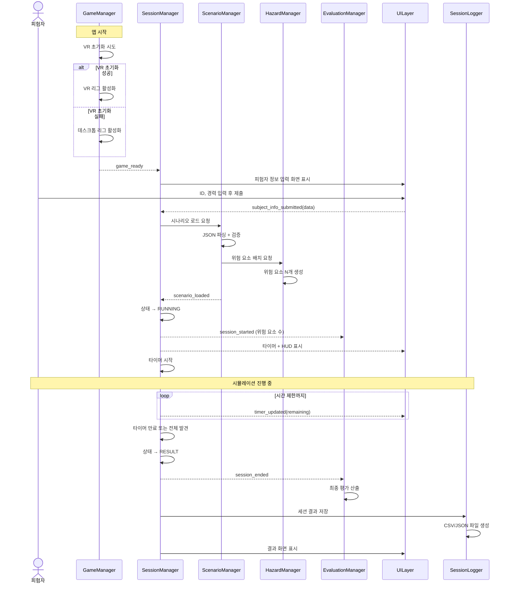
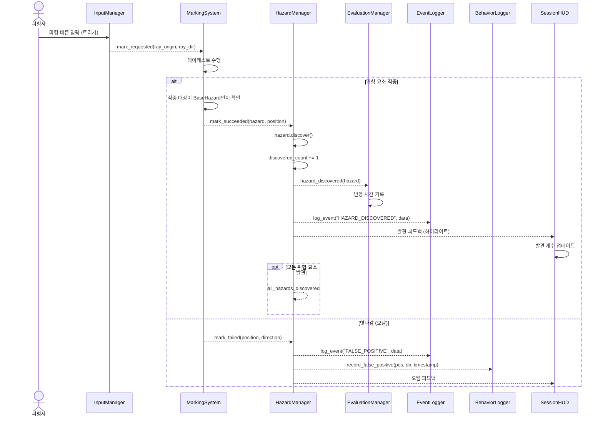
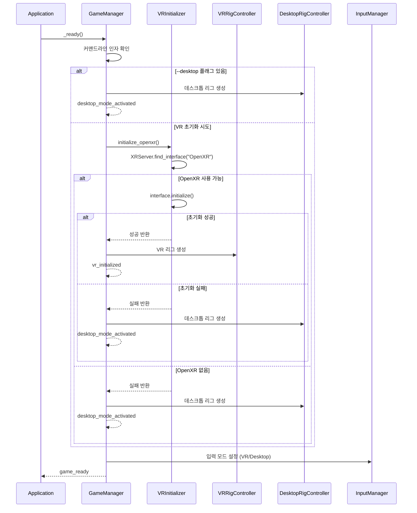

# VR 건설 현장 안전 점검 시뮬레이션 — 아키텍처 설계서

## 메타데이터

| 항목 | 내용 |
|---|---|
| **기준 문서** | `docs/requirements.md`, `docs/specs.md`, `docs/todo.md` |
| **아키텍처 패턴** | Layered Architecture + SOLID |
| **기술 스택** | Godot 4, GDScript, OpenXR, Meta Quest |
| **생성일** | 2026-04-01 |
| **Spec 수** | 20개 (모두 매핑 완료) |

---

## 0. 시스템 개요

### 0.1 컴포넌트 다이어그램

```mermaid
graph TB
    subgraph Presentation ["Presentation Layer (씬 노드, UI, VR)"]
        VRRig["VR Rig<br/><small>VRRigController</small>"]
        DesktopRig["Desktop Rig<br/><small>DesktopRigController</small>"]
        Site["Construction Site<br/><small>BuildingFrameSite</small>"]
        Hazards["Hazard Visuals<br/><small>CrackHazard, ...</small>"]
        UI["UI Layer<br/><small>SubjectInfoUI / SessionHUD / ResultUI</small>"]
        Loco["Locomotion<br/><small>캐릭터 이동</small>"]
        Mark["MarkingSystem<br/><small>레이캐스트 마킹</small>"]
        Gaze["GazeTracker<br/><small>시선 추적</small>"]
    end

    subgraph Application ["Application Layer (유스케이스 조율)"]
        GM["GameManager<br/><small>VR/Desktop 초기화</small>"]
        SM["SessionManager<br/><small>세션 상태 머신</small>"]
        ScM["ScenarioManager<br/><small>시나리오 로딩/배치</small>"]
        HM["HazardManager<br/><small>위험 요소 관리</small>"]
        EM["EvaluationManager<br/><small>발견율/반응시간</small>"]
        IM["InputManager<br/><small>입력 추상화</small>"]
    end

    subgraph Domain ["Domain Layer (핵심 로직)"]
        EvalSvc["EvaluationService<br/><small>순수 평가 계산</small>"]
        ScnValid["ScenarioValidator<br/><small>시나리오 검증</small>"]
        HazRules["HazardRules<br/><small>위험 요소 판정 규칙</small>"]
        Data["Data Models<br/><small>SessionData / ScenarioData / HazardData</small>"]
    end

    subgraph Infrastructure ["Infrastructure Layer (파일 I/O, 외부 연동)"]
        SL["SessionLogger<br/><small>결과 저장</small>"]
        EL["EventLogger<br/><small>타임스탬프 로깅</small>"]
        BL["BehaviorLogger<br/><small>행동 로깅</small>"]
        LSL["LSLBridge<br/><small>EEG 연동</small>"]
        FU["FileUtils<br/><small>파일 I/O 유틸</small>"]
    end

    subgraph External ["External"]
        Quest["Meta Quest<br/><small>OpenXR</small>"]
        EEG["EEG Device<br/><small>뇌파 측정</small>"]
        FS["File System<br/><small>CSV / JSON</small>"]
    end

    %% Presentation → Application (위에서 아래로)
    UI -->|"사용자 입력"| SM
    Mark -->|"마킹 결과"| HM
    Gaze -->|"시선 데이터"| BL

    %% Application → Presentation
    GM -->|"리그 전환"| VRRig
    GM -->|"폴백"| DesktopRig
    ScM -->|"씬 로드"| Site
    HM -->|"생성/제거"| Hazards
    SM -->|"상태 변경"| UI
    IM -->|"이동 명령"| Loco
    IM -->|"마킹 명령"| Mark

    %% Application → Domain
    EM -->|"계산 위임"| EvalSvc
    ScM -->|"검증 위임"| ScnValid
    HM -->|"규칙 조회"| HazRules
    EM -->|"평가 결과"| Data

    %% Application 간 시그널
    GM -.->|"game_ready"| SM
    SM -.->|"session_started"| HM
    SM -.->|"session_started"| EM
    SM -.->|"session_started"| ScM
    HM -.->|"hazard_discovered"| EM
    HM -.->|"hazard_discovered"| EL

    %% Infrastructure → Domain (의존성 역전: Domain 인터페이스 구현)
    SL -->|"직렬화"| Data
    EL -->|"이벤트 기록"| Data

    %% Infrastructure → External
    SL -->|"저장"| FS
    EL -->|"저장"| FS
    BL -->|"저장"| FS
    LSL <-->|"LSL 프로토콜"| EEG

    %% Presentation → External
    VRRig <-->|"OpenXR"| Quest

    %% Application → Infrastructure
    SM -->|"세션 데이터"| SL
    SM -.->|"session_ended"| SL
    HM -.->|"false_positive"| EL
```



### 0.2 시퀀스 다이어그램 — 세션 라이프사이클



### 0.3 시퀀스 다이어그램 — 위험 요소 탐지 및 마킹



### 0.4 시퀀스 다이어그램 — VR 초기화 및 데스크톱 폴백



---

## 1. 프로젝트 디렉토리 구조

```
convergence/
├── project.godot                    # Godot 프로젝트 설정
├── export_presets.cfg               # 내보내기 설정 (Quest 등)
│
├── assets/                          # 정적 리소스
│   ├── models/                      # 3D 모델 (.glb, .obj)
│   ├── materials/                   # 머티리얼 (.tres)
│   ├── textures/                    # 텍스처 (.png, .jpg)
│   ├── shaders/                     # 셰이더 (.gdshader)
│   └── sounds/                      # 효과음 (.wav, .ogg)
│
├── scenes/                          # Presentation Layer — .tscn 씬 파일
│   ├── main.tscn                    # 메인 진입 씬
│   ├── vr_rig/
│   │   ├── vr_rig.tscn              # VR 플레이어 리그
│   │   └── desktop_rig.tscn         # 데스크톱 폴백 리그
│   ├── environment/
│   │   ├── base_site.tscn           # 현장 베이스 씬 (추상)
│   │   └── building_frame_site.tscn # 건물 골조 현장
│   ├── hazards/
│   │   ├── base_hazard.tscn         # 위험 요소 베이스 씬
│   │   └── crack_hazard.tscn        # 크랙 위험 요소
│   └── ui/
│       ├── subject_info_ui.tscn     # 피험자 정보 입력
│       ├── session_hud.tscn         # 세션 중 HUD (타이머 등)
│       └── result_ui.tscn           # 결과 표시
│
├── scripts/                         # 전체 스크립트 (Layered Architecture)
│   ├── application/                 # Application Layer — 유스케이스 조율, 매니저
│   │   ├── game_manager.gd          # 최상위 초기화/종료 (Autoload)
│   │   ├── session_manager.gd       # 세션 상태 머신 (Autoload)
│   │   ├── scenario_manager.gd      # 시나리오 로딩/관리 (Autoload)
│   │   ├── hazard_manager.gd        # 위험 요소 관리 (Autoload)
│   │   ├── evaluation_manager.gd    # 발견율/반응시간 산출 (Autoload)
│   │   └── input_manager.gd         # 입력 추상화 (Autoload)
│   │
│   ├── domain/                      # Domain Layer — 핵심 비즈니스 로직
│   │   ├── models/                  # 데이터 모델 (Resource)
│   │   │   ├── session_data.gd      # 세션 데이터
│   │   │   ├── subject_data.gd      # 피험자 데이터
│   │   │   ├── hazard_data.gd       # 위험 요소 데이터
│   │   │   ├── scenario_data.gd     # 시나리오 설정 데이터
│   │   │   ├── marking_result.gd    # 마킹 결과 데이터
│   │   │   └── behavior_sample.gd   # 행동 샘플 데이터
│   │   └── services/                # 순수 도메인 서비스 (Godot 노드 비의존)
│   │       ├── evaluation_service.gd    # 발견율/반응시간 순수 계산
│   │       ├── scenario_validator.gd    # 시나리오 JSON 검증
│   │       └── hazard_rules.gd          # 위험 요소 판정 규칙
│   │
│   ├── infrastructure/              # Infrastructure Layer — 파일 I/O, 외부 연동
│   │   ├── session_logger.gd        # 세션 결과 파일 저장
│   │   ├── event_logger.gd          # EEG 동기화용 타임스탬프 로거
│   │   ├── behavior_logger.gd       # 행동 로깅 (이동, 시선, 오탐)
│   │   ├── lsl_bridge.gd            # LSL 실시간 연동 브릿지
│   │   └── file_utils.gd            # 파일 I/O 유틸리티
│   │
│   ├── presentation/                # Presentation Layer — 씬 노드, UI, VR, 입력
│   │   ├── vr/                      # VR/데스크톱 전환 로직
│   │   │   ├── vr_initializer.gd    # OpenXR 초기화
│   │   │   ├── vr_rig_controller.gd # VR 리그 제어
│   │   │   ├── desktop_rig_controller.gd # 데스크톱 리그 제어
│   │   │   └── rig_interface.gd     # 리그 공통 인터페이스 (추상 베이스)
│   │   ├── hazards/                 # 위험 요소 비주얼 스크립트
│   │   │   ├── base_hazard.gd       # 위험 요소 추상 베이스
│   │   │   ├── crack_hazard.gd      # 크랙 구현
│   │   │   ├── crack_generator.gd   # 크랙 절차적 생성
│   │   │   └── random_placement.gd  # 랜덤 배치 알고리즘
│   │   ├── environment/             # 환경 스크립트
│   │   │   ├── base_site.gd         # 현장 추상 베이스
│   │   │   └── building_frame_site.gd # 건물 골조 구현
│   │   ├── ui/                      # UI 스크립트
│   │   │   ├── subject_info_ui.gd   # 피험자 정보 입력 UI
│   │   │   ├── session_hud.gd       # 세션 HUD
│   │   │   └── result_ui.gd         # 결과 표시 UI
│   │   └── input/                   # 입력 처리
│   │       ├── gaze_tracker.gd      # 시선 추적 (화면 중심 기반)
│   │       ├── marking_system.gd    # 마킹 시스템 (레이캐스트)
│   │       └── locomotion.gd        # 이동 시스템
│   │
│   └── utils/                       # 유틸리티 (계층 공통)
│       ├── constants.gd             # 상수 정의
│       └── timestamp_utils.gd       # 타임스탬프 유틸
│
├── resources/                       # 데이터 리소스 파일
│   ├── scenarios/                   # 시나리오 설정 JSON
│   │   ├── default_scenario.json    # 기본 시나리오 (MVP 크랙 3개)
│   │   └── scenario_template.json   # 템플릿 (연구자용 예시)
│   └── config/
│       └── app_config.json          # 애플리케이션 전역 설정
│
├── tests/                           # GUT 테스트 프레임워크
│   ├── unit/                        # 유닛 테스트
│   │   ├── test_session_manager.gd
│   │   ├── test_hazard_manager.gd
│   │   ├── test_evaluation_manager.gd
│   │   ├── test_scenario_manager.gd
│   │   ├── test_session_logger.gd
│   │   ├── test_event_logger.gd
│   │   ├── test_behavior_logger.gd
│   │   ├── test_gaze_tracker.gd
│   │   ├── test_marking_system.gd
│   │   └── test_random_placement.gd
│   ├── integration/                 # 통합 테스트
│   │   ├── test_session_flow.gd
│   │   ├── test_hazard_detection.gd
│   │   └── test_data_pipeline.gd
│   └── fixtures/                    # 테스트 데이터
│       └── test_scenario.json
│
├── data/                            # 런타임 출력 데이터 (gitignore)
│   └── sessions/                    # 세션 결과 파일
│
└── docs/                            # 프로젝트 문서
    ├── requirements.md
    ├── specs.md
    ├── todo.md
    └── architecture.md              # 본 문서
```

### 네이밍 컨벤션

| 대상 | 규칙 | 예시 |
|------|------|------|
| 폴더 | `snake_case` | `presentation/vr/`, `domain/models/` |
| 씬 파일 | `snake_case.tscn` | `vr_rig.tscn`, `crack_hazard.tscn` |
| 스크립트 | `snake_case.gd` | `session_manager.gd`, `base_hazard.gd` |
| 클래스명 | `PascalCase` | `SessionManager`, `BaseHazard` |
| 시그널 | `snake_case` (과거형/완료형) | `hazard_discovered`, `session_started` |
| 상수 | `UPPER_SNAKE_CASE` | `DEFAULT_TIME_LIMIT`, `MAX_RAY_DISTANCE` |
| Resource 파일 | `snake_case.tres` | `hazard_data.tres` |
| JSON 키 | `snake_case` | `scenario_id`, `time_limit_seconds` |

---

## 2. Layered Architecture 매핑

Layered Architecture는 관심사를 4개 계층으로 분리하며, **의존 방향은 위에서 아래로만 흐른다** (아래 계층은 위 계층을 알지 못한다). Godot 4의 노드 시스템에 맞게 다음과 같이 매핑한다.

```
┌─────────────────────────────────────────────────────────────┐
│                   Presentation Layer                         │
│  scenes/ + scripts/presentation/                             │
│  - 3D 씬 렌더링, UI 표시, VR/데스크톱 리그                  │
│  - 입력 처리 (Locomotion, MarkingSystem, GazeTracker)        │
│  - 사용자에게 보이는 모든 것                                │
├─────────────────────────────────────────────────────────────┤
│                   Application Layer                          │
│  scripts/application/                                        │
│  - 유스케이스 조율, 상태 관리, Autoload 매니저               │
│  - Presentation과 Domain/Infrastructure를 연결               │
├─────────────────────────────────────────────────────────────┤
│                     Domain Layer                             │
│  scripts/domain/                                             │
│  - 핵심 비즈니스 로직 (순수 계산, 검증, 판정 규칙)          │
│  - 데이터 모델 (Resource 클래스)                            │
│  - Godot 노드 비의존 순수 GDScript 클래스                   │
├─────────────────────────────────────────────────────────────┤
│                  Infrastructure Layer                        │
│  scripts/infrastructure/                                     │
│  - 파일 I/O, 로깅, 외부 시스템 연동 (LSL)                  │
│  - Domain 인터페이스의 구현체                               │
└─────────────────────────────────────────────────────────────┘
```

| 계층 | Godot 구현 | 디렉토리 | 역할 | 관련 Spec 영역 |
|------|-----------|---------|------|--------------|
| **Presentation** | .tscn 씬, UI/3D 노드, 입력 노드 | `scenes/`, `scripts/presentation/` | 렌더링, UI, 입력 처리, VR 리그 | ENV, SES(UI), VR(리그), INP |
| **Application** | Autoload 싱글톤 | `scripts/application/` | 유스케이스 조율, 상태 관리 | VR, HAZ, SES, INP, SCN |
| **Domain** | RefCounted 클래스, Custom Resource | `scripts/domain/` | 핵심 로직, 데이터 모델, 검증 | DAT, SCN |
| **Infrastructure** | Node 스크립트, GDExtension | `scripts/infrastructure/` | 파일 저장, 로깅, 외부 연동 | DAT |

### 계층 간 의존 규칙

1. **Presentation -> Application**: 사용자 입력 이벤트를 Application에 전달 (시그널 또는 메서드 호출)
2. **Application -> Domain**: 비즈니스 로직 실행 위임, 데이터 모델 읽기/쓰기
3. **Application -> Infrastructure**: 영속성(저장/로깅) 요청
4. **Application -> Presentation**: 상태 변경을 시그널로 통지, Presentation이 구독하여 표현 갱신
5. **Infrastructure -> Domain**: Domain의 데이터 모델을 사용하여 직렬화/역직렬화
6. **Domain은 다른 계층을 모른다**: 순수 비즈니스 로직과 데이터 정의만 담당
7. **Infrastructure는 Application/Presentation을 모른다**: 저장과 외부 연동만 담당

---

## 3. 씬 트리 구조

### 메인 씬 (main.tscn)

```
Main (Node3D)
│
├── WorldEnvironment                          # 환경 설정 (조명, 하늘)
│   └── DirectionalLight3D                    # 태양광
│
├── PlayerRig (Node3D)                        # ← 동적 교체: VR 또는 Desktop
│   │                                         #    SPEC-VR-001, SPEC-VR-002
│   ├── [VR 모드] XROrigin3D
│   │   ├── XRCamera3D                        # 머리 추적 카메라
│   │   │   └── GazeCrosshair (MeshInstance3D) # SPEC-INP-003 (시선 중심점)
│   │   ├── XRController3D (Left)             # 왼손 컨트롤러
│   │   │   └── LeftControllerModel
│   │   └── XRController3D (Right)            # 오른손 컨트롤러
│   │       ├── RightControllerModel
│   │       └── MarkingRay (RayCast3D)        # SPEC-INP-002 (마킹 레이)
│   │
│   └── [데스크톱 모드] DesktopRig (CharacterBody3D)
│       ├── Camera3D                          # 일반 카메라
│       │   └── GazeCrosshair
│       └── MarkingRay (RayCast3D)            # 마우스 클릭 마킹
│
├── SiteContainer (Node3D)                    # ← 동적 로드: 현장 유형별
│   │                                         #    SPEC-ENV-001, SPEC-ENV-003
│   └── BuildingFrameSite (Node3D)            # 건물 골조 현장 (기본)
│       ├── Floor (StaticBody3D)              #   바닥면 + CollisionShape3D
│       ├── Columns (Node3D)                  #   기둥들
│       │   ├── Column_01 (StaticBody3D)
│       │   ├── Column_02 (StaticBody3D)
│       │   ├── Column_03 (StaticBody3D)
│       │   └── Column_04 (StaticBody3D)
│       ├── Beams (Node3D)                    #   보들
│       │   ├── Beam_01 (StaticBody3D)
│       │   ├── Beam_02 (StaticBody3D)
│       │   ├── Beam_03 (StaticBody3D)
│       │   └── Beam_04 (StaticBody3D)
│       ├── Slabs (Node3D)                    #   슬래브
│       │   └── Slab_01 (StaticBody3D)
│       └── Walls (Node3D)                    #   벽체
│           └── Wall_01 (StaticBody3D)
│
├── HazardContainer (Node3D)                  # SPEC-HAZ-001, SPEC-HAZ-002, SPEC-HAZ-003
│   │                                         # ← 동적 생성: 시나리오에 따라
│   ├── CrackHazard_01 (Area3D)               #   크랙 위험 요소
│   │   ├── CollisionShape3D                  #   탐지 영역
│   │   ├── CrackVisual (MeshInstance3D)      #   시각적 표현
│   │   └── DiscoveredIndicator (Node3D)      #   발견 시 표시 (초기 비활성)
│   ├── CrackHazard_02 (Area3D)
│   └── CrackHazard_03 (Area3D)
│
└── UILayer (CanvasLayer)                     # SPEC-SES-001, SPEC-SES-002
    ├── SubjectInfoUI (Control)               #   피험자 정보 입력 화면
    │   ├── IDInput (LineEdit)
    │   ├── ExperienceInput (OptionButton)
    │   └── StartButton (Button)
    ├── SessionHUD (Control)                  #   세션 중 HUD
    │   ├── TimerLabel (Label)                #   남은 시간 표시
    │   ├── DiscoveryCounter (Label)          #   발견 현황 (선택적)
    │   └── CrosshairUI (TextureRect)         #   크로스헤어
    └── ResultUI (Control)                    #   결과 표시 화면
        ├── SummaryPanel
        └── NextButton (Button)
```

### Autoload 구성

Godot의 Autoload(싱글톤)으로 등록되는 매니저 노드들:

```
project.godot [autoload 섹션]
│
├── GameManager     = "res://scripts/application/game_manager.gd"
├── SessionManager  = "res://scripts/application/session_manager.gd"
├── ScenarioManager = "res://scripts/application/scenario_manager.gd"
├── HazardManager   = "res://scripts/application/hazard_manager.gd"
├── EvaluationManager = "res://scripts/application/evaluation_manager.gd"
└── InputManager    = "res://scripts/application/input_manager.gd"
```

---

## 4. 핵심 시스템 설계

### 4.1 GameManager (Application Layer / Autoload)

**책임**: 애플리케이션 생명주기 관리, VR/데스크톱 모드 결정, 글로벌 초기화/종료

**관련 Spec**: `SPEC-VR-001`, `SPEC-VR-002`

```
GameManager
├── 속성
│   ├── is_vr_mode: bool              # VR 모드 여부
│   ├── vr_initializer: VRInitializer # VR 초기화 담당
│   └── current_rig: RigInterface     # 현재 활성 리그 (VR 또는 Desktop)
│
├── 시그널
│   ├── vr_initialized()              # VR 초기화 성공
│   ├── desktop_mode_activated()      # 데스크톱 모드 전환
│   └── game_ready()                  # 모든 초기화 완료
│
├── 메서드
│   ├── _ready()                      # 진입점: VR 초기화 시도
│   ├── _initialize_vr() -> bool      # OpenXR 초기화
│   ├── _fallback_to_desktop()        # 데스크톱 모드 전환
│   ├── get_camera() -> Camera3D      # 현재 모드의 카메라 반환
│   └── quit_application()            # 안전 종료
│
└── SOLID 원칙
    ├── S: VR/데스크톱 초기화만 담당
    ├── O: 새 리그 타입 추가 시 RigInterface 구현만 추가
    ├── L: VR/Desktop 리그 모두 RigInterface로 교체 가능
    ├── I: vr_initialized와 desktop_mode_activated 시그널 분리
    └── D: 구체 리그가 아닌 RigInterface에 의존
```

### 4.2 SessionManager (Application Layer / Autoload)

**책임**: 세션 상태 머신 관리 (초기화 -> 정보입력 -> 진행 -> 결과 -> 종료)

**관련 Spec**: `SPEC-SES-001`, `SPEC-SES-002`, `SPEC-SES-003`

```
SessionManager
├── 속성
│   ├── current_state: SessionState   # 현재 상태 (enum)
│   ├── session_data: SessionData     # 현재 세션 데이터 (Domain)
│   ├── timer: Timer                  # 세션 타이머
│   └── time_remaining: float         # 남은 시간 (초)
│
├── 시그널
│   ├── state_changed(old, new)       # 상태 전환
│   ├── session_started()             # 시뮬레이션 진행 시작
│   ├── session_ended(reason)         # 세션 종료 (시간초과/수동/전체발견)
│   ├── timer_updated(remaining)      # 타이머 갱신 (매초)
│   └── subject_info_submitted(data)  # 피험자 정보 제출
│
├── 메서드
│   ├── start_new_session()           # 세션 시작 (초기화 상태로)
│   ├── submit_subject_info(data)     # 피험자 정보 제출 -> 진행 상태로
│   ├── end_session(reason)           # 세션 종료 -> 결과 상태로
│   ├── request_early_end()           # 조기 종료 요청
│   ├── proceed_to_next()             # 결과 -> 다음 세션 또는 종료
│   └── get_elapsed_time() -> float   # 경과 시간 (ms)
│
├── 상태 머신 (enum SessionState)
│   ├── INITIALIZING                  # 씬 로드, 시나리오 적용
│   ├── SUBJECT_INPUT                 # 피험자 정보 입력 대기
│   ├── RUNNING                       # 시뮬레이션 진행 중
│   ├── RESULT                        # 결과 표시/저장
│   └── ENDED                         # 종료
│
└── SOLID 원칙
    ├── S: 세션 생명주기만 관리
    ├── O: 새 상태 추가 시 enum 확장
    ├── L: 상태 전환 규칙이 일관됨
    ├── I: 상태별 시그널 분리
    └── D: SessionData(Domain)에만 의존, Presentation을 직접 제어하지 않음
```

### 4.3 ScenarioManager (Application Layer / Autoload)

**책임**: 시나리오 설정 파일 로딩, 파싱, 검증 조율, 랜덤 배치 생성 (검증 로직은 Domain의 ScenarioValidator에 위임)

**관련 Spec**: `SPEC-SCN-001`, `SPEC-SCN-002`, `SPEC-ENV-003`

```
ScenarioManager
├── 속성
│   ├── current_scenario: ScenarioData  # 현재 로드된 시나리오
│   ├── default_scenario_path: String   # 기본 시나리오 경로
│   └── random_seed: int                # 랜덤 시드
│
├── 시그널
│   ├── scenario_loaded(data)           # 시나리오 로드 완료
│   ├── scenario_load_failed(error)     # 시나리오 로드 실패
│   └── hazards_placed()                # 위험 요소 배치 완료
│
├── 메서드
│   ├── load_scenario(path) -> ScenarioData  # JSON 파일 로드 및 검증
│   ├── load_default_scenario()              # 기본 시나리오 로드
│   ├── validate_scenario(data) -> Array     # 스키마 검증, 에러 목록 반환
│   ├── get_site_type() -> String            # 현장 유형 반환
│   ├── generate_random_placement(config) -> Array  # 랜덤 배치 생성
│   └── apply_scenario()                     # 시나리오를 씬에 적용
│
└── SOLID 원칙
    ├── S: 시나리오 로딩/관리만 담당
    ├── O: 새 현장 유형은 site_type 필드 확장으로 대응
    ├── L: 모든 시나리오가 동일 스키마를 따름
    ├── I: loaded와 load_failed 시그널 분리
    └── D: ScenarioData(Domain)에 의존, 검증은 ScenarioValidator(Domain)에 위임, 파일 시스템 직접 접근 안 함 (Infrastructure의 file_utils 사용)
```

### 4.4 HazardManager (Application Layer / Autoload)

**책임**: 위험 요소 인스턴스 관리, 상태 추적, 발견 처리 (판정 규칙은 Domain의 HazardRules에 위임)

**관련 Spec**: `SPEC-HAZ-001`, `SPEC-HAZ-002`, `SPEC-HAZ-003`, `SPEC-ENV-002`

```
HazardManager
├── 속성
│   ├── hazards: Array[BaseHazard]      # 현재 씬의 모든 위험 요소
│   ├── discovered_count: int           # 발견된 위험 요소 수
│   └── hazard_container: Node3D        # 위험 요소 컨테이너 노드
│
├── 시그널
│   ├── hazard_spawned(hazard)          # 위험 요소 생성됨
│   ├── hazard_discovered(hazard)       # 위험 요소 발견됨
│   ├── false_positive(position, direction) # 오탐 발생
│   ├── all_hazards_discovered()        # 모든 위험 요소 발견
│   └── hazards_cleared()              # 모든 위험 요소 제거됨
│
├── 메서드
│   ├── spawn_hazard(data: HazardData) -> BaseHazard  # 위험 요소 생성
│   ├── spawn_hazards_from_scenario(scenario)          # 시나리오 기반 일괄 생성
│   ├── attempt_mark(ray_origin, ray_dir) -> MarkingResult  # 마킹 시도
│   ├── get_all_hazards() -> Array                     # 전체 위험 요소 목록
│   ├── get_discovered_hazards() -> Array              # 발견된 것만
│   ├── get_undiscovered_hazards() -> Array             # 미발견만
│   ├── get_discovery_rate() -> float                  # 발견율 (0.0~1.0)
│   └── clear_all_hazards()                            # 전체 제거
│
└── SOLID 원칙
    ├── S: 위험 요소 관리만 담당 (생성, 상태, 조회)
    ├── O: BaseHazard를 상속하는 새 유형 추가 시 기존 코드 수정 없음
    ├── L: CrackHazard 등 서브클래스가 BaseHazard 자리에 투명하게 교체
    ├── I: hazard_discovered, false_positive 등 이벤트별 시그널 분리
    └── D: BaseHazard 추상 타입에 의존, 구체 Hazard 클래스를 직접 참조 안 함
```

### 4.5 EvaluationManager (Application Layer / Autoload)

**책임**: 발견율, 반응 시간 실시간 산출, 평가 결과 생성 (순수 계산은 Domain의 EvaluationService에 위임)

**관련 Spec**: `SPEC-DAT-002`

```
EvaluationManager
├── 속성
│   ├── session_start_time: float        # 세션 시작 시각 (ms)
│   ├── reaction_times: Dictionary       # {hazard_id: reaction_time_ms}
│   └── total_hazards: int               # 전체 위험 요소 수
│
├── 시그널
│   ├── evaluation_updated(rate, times)  # 평가 데이터 갱신
│   └── evaluation_finalized(result)     # 최종 평가 확정
│
├── 메서드
│   ├── start_evaluation(total_count)    # 평가 시작
│   ├── record_discovery(hazard_id)      # 발견 기록 -> 반응시간 산출
│   ├── get_discovery_rate() -> float    # 발견율 (소수점 1자리)
│   ├── get_reaction_times() -> Dictionary  # 개별 반응시간
│   ├── get_avg_reaction_time() -> float    # 평균 반응시간
│   └── finalize() -> Dictionary         # 최종 평가 결과 반환
│
└── SOLID 원칙
    ├── S: 평가 조율만 담당 (순수 계산은 EvaluationService, 저장은 Infrastructure 책임)
    ├── O: 새 평가 지표 추가 시 EvaluationService에 메서드 추가
    └── D: HazardManager의 시그널에만 의존, 순수 계산은 Domain의 EvaluationService에 위임
```

### 4.6 InputManager (Application Layer / Autoload)

**책임**: VR/데스크톱 입력 추상화, 마킹/이동/시선 이벤트 통합

**관련 Spec**: `SPEC-INP-001`, `SPEC-INP-002`, `SPEC-INP-003`

```
InputManager
├── 속성
│   ├── is_vr_mode: bool                 # VR 모드 여부 (GameManager 참조)
│   ├── move_speed: float                # 이동 속도 (기본 3.0 m/s)
│   ├── snap_turn_degrees: float         # 스냅 턴 각도 (기본 45도)
│   └── max_ray_distance: float          # 마킹 레이 최대 거리 (기본 50m)
│
├── 시그널
│   ├── mark_requested(ray_origin, ray_direction)  # 마킹 버튼 입력
│   ├── movement_input(direction: Vector3)          # 이동 입력
│   ├── snap_turn_requested(direction: float)       # 회전 입력
│   └── controller_disconnected()                   # 컨트롤러 연결 끊김
│
├── 메서드
│   ├── _process(delta)                  # 매 프레임 입력 처리
│   ├── _handle_vr_input()               # VR 컨트롤러 입력 처리
│   ├── _handle_desktop_input()          # 키보드/마우스 입력 처리
│   └── set_marking_ray_visible(v: bool) # 레이 시각화 on/off
│
└── SOLID 원칙
    ├── S: 입력 수집/변환만 담당 (실제 이동은 Locomotion, 마킹은 MarkingSystem)
    ├── O: 새 입력 장치 추가 시 핸들러 메서드만 추가
    ├── I: mark, movement, turn 시그널 분리
    └── D: GameManager.is_vr_mode에만 의존, 구체 컨트롤러 노드 직접 참조 최소화
```

### 4.7 데이터 로깅 시스템 (Infrastructure Layer)

#### SessionLogger (scripts/infrastructure/session_logger.gd)

**책임**: 세션 결과를 CSV/JSON으로 저장

**관련 Spec**: `SPEC-DAT-001`

```
SessionLogger
├── 메서드
│   ├── save_session_result(session_data: SessionData) -> String  # 결과 저장, 파일 경로 반환
│   ├── save_json(data, path)         # JSON 형식 저장
│   ├── save_csv(data, path)          # CSV 형식 저장 (스프레드시트 호환)
│   └── _generate_filename(subject_id, timestamp) -> String  # 파일명 생성
│
├── 시그널
│   ├── save_completed(path)          # 저장 완료
│   └── save_failed(error)            # 저장 실패
```

#### EventLogger (scripts/infrastructure/event_logger.gd)

**책임**: EEG 동기화용 고정밀 타임스탬프 이벤트 기록

**관련 Spec**: `SPEC-DAT-003`

```
EventLogger
├── 메서드
│   ├── log_event(type: String, data: Dictionary)  # 이벤트 기록
│   ├── get_session_start_epoch() -> int           # 세션 시작 절대 시간 (Unix ms)
│   ├── flush()                                    # 버퍼를 파일에 기록
│   └── save_event_log(path)                       # 이벤트 로그 파일 저장
│
├── 기록 이벤트 타입
│   ├── SESSION_START, SESSION_END
│   ├── HAZARD_DISCOVERED, MARK_ATTEMPT
│   └── MOVEMENT_START, MOVEMENT_STOP
```

#### BehaviorLogger (scripts/infrastructure/behavior_logger.gd)

**책임**: 이동 경로, 시선 방향, 오탐 샘플링 기록

**관련 Spec**: `SPEC-DAT-004`

```
BehaviorLogger
├── 속성
│   ├── position_sample_interval: float  # 이동 샘플링 주기 (기본 200ms)
│   ├── gaze_sample_interval: float      # 시선 샘플링 주기 (기본 100ms)
│   └── buffer: Array                    # 메모리 버퍼
│
├── 메서드
│   ├── start_logging()                  # 로깅 시작
│   ├── stop_logging()                   # 로깅 중단
│   ├── record_position(pos: Vector3, timestamp: int)    # 위치 기록
│   ├── record_gaze(direction: Vector3, timestamp: int)  # 시선 기록
│   ├── record_false_positive(pos, dir, timestamp)       # 오탐 기록
│   ├── flush_buffer()                   # 버퍼 -> 파일 (주기적)
│   └── save_behavior_log(path)          # 최종 저장
```

#### LSLBridge (scripts/infrastructure/lsl_bridge.gd)

**책임**: Lab Streaming Layer 실시간 연동

**관련 Spec**: `SPEC-DAT-005`

```
LSLBridge
├── 속성
│   ├── is_available: bool               # LSL 라이브러리 사용 가능 여부
│   ├── outlet: LSLOutlet                # VR 이벤트 스트리밍
│   └── inlet: LSLInlet                  # EEG 데이터 수신 (선택적)
│
├── 시그널
│   ├── lsl_connected()                  # LSL 연결 성공
│   ├── lsl_disconnected()               # LSL 연결 끊김
│   └── lsl_unavailable()                # LSL 라이브러리 없음
│
├── 메서드
│   ├── initialize() -> bool             # LSL 초기화 시도
│   ├── push_event(type, data)           # 이벤트 스트리밍
│   ├── is_connected() -> bool           # 연결 상태 확인
│   └── shutdown()                       # 안전 종료
│
├── 폴백
│   └── LSL 미사용 시 EventLogger (SPEC-DAT-003)로 자동 폴백
```

### 4.8 시선 추적 (GazeTracker) (Presentation Layer)

**책임**: 화면 중심 기반 시선 방향 추정 및 주기적 기록

**관련 Spec**: `SPEC-INP-003`

```
GazeTracker (scripts/presentation/input/gaze_tracker.gd)
├── 속성
│   ├── sample_interval_ms: float        # 샘플링 주기 (기본 100ms)
│   ├── is_tracking: bool                # 추적 활성화 여부
│   └── camera_ref: Camera3D             # 추적 대상 카메라
│
├── 시그널
│   └── gaze_sampled(direction: Vector3, timestamp: int)  # 시선 샘플 발생
│
├── 메서드
│   ├── start_tracking(camera: Camera3D) # 추적 시작
│   ├── stop_tracking()                  # 추적 중단
│   └── get_current_gaze() -> Vector3    # 현재 시선 방향
```

### 4.9 이동 시스템 (Locomotion) (Presentation Layer)

**책임**: 조이스틱/키보드 기반 캐릭터 이동, 충돌 처리

**관련 Spec**: `SPEC-INP-001`, `SPEC-VR-002`

```
Locomotion (scripts/presentation/input/locomotion.gd)
├── 메서드
│   ├── apply_movement(direction: Vector3, delta: float)  # 이동 적용
│   ├── apply_snap_turn(degrees: float)                   # 스냅 턴
│   ├── set_speed(speed: float)                           # 이동 속도 변경
│   └── is_grounded() -> bool                             # 바닥 접촉 여부
```

### 4.10 마킹 시스템 (MarkingSystem) (Presentation Layer)

**책임**: 레이캐스트 기반 마킹, 위험 요소 판별, 피드백

**관련 Spec**: `SPEC-INP-002`

```
MarkingSystem (scripts/presentation/input/marking_system.gd)
├── 속성
│   ├── ray_cast: RayCast3D              # 마킹 레이
│   └── max_distance: float              # 최대 탐지 거리 (기본 50m)
│
├── 시그널
│   ├── mark_succeeded(hazard, position) # 마킹 성공 (위험 요소 적중)
│   ├── mark_failed(position, direction) # 마킹 실패 (오탐)
│   └── mark_feedback(success: bool)     # 피드백 트리거
│
├── 메서드
│   ├── perform_mark(origin, direction)  # 마킹 수행
│   ├── set_ray_visible(visible: bool)   # 레이 시각화 on/off
│   └── _check_hit(collision) -> bool    # 적중 대상이 위험 요소인지 판별
```

### 4.11 EvaluationService (Domain Layer)

**책임**: 발견율, 반응 시간 등 평가 지표의 순수 계산 로직 (Godot 노드 비의존)

**파일**: `scripts/domain/services/evaluation_service.gd`

```
EvaluationService (scripts/domain/services/evaluation_service.gd)
│   extends RefCounted  ← Godot 노드를 상속하지 않음
│
├── 메서드
│   ├── calculate_discovery_rate(discovered: int, total: int) -> float
│   │   # 발견율 산출 (0.0~100.0, 소수점 1자리)
│   ├── calculate_reaction_time(start_ms: int, discovery_ms: int) -> float
│   │   # 개별 반응 시간 산출 (ms)
│   └── calculate_avg_reaction_time(times: Array) -> float
│       # 평균 반응 시간 산출 (ms)
│
└── 특성
    ├── 순수 GDScript 클래스 (RefCounted): 씬 트리 없이 인스턴스화 가능
    ├── 유닛 테스트가 씬 트리 없이 가능
    └── EvaluationManager(Application)가 이 서비스에 계산을 위임
```

### 4.12 ScenarioValidator (Domain Layer)

**책임**: 시나리오 JSON 데이터의 스키마 검증 순수 로직

**파일**: `scripts/domain/services/scenario_validator.gd`

```
ScenarioValidator (scripts/domain/services/scenario_validator.gd)
│   extends RefCounted  ← Godot 노드를 상속하지 않음
│
├── 메서드
│   └── validate(data: Dictionary) -> Array[String]
│       # 시나리오 데이터 검증, 에러 목록 반환 (빈 배열이면 유효)
│       # 검증 항목:
│       #   - scenario_id 존재 및 비어있지 않음
│       #   - site_type 유효성
│       #   - time_limit_seconds 양의 정수
│       #   - hazards 배열 각 항목의 필수 필드 존재
│       #   - difficulty 범위 (0.0~1.0)
│
└── 특성
    ├── 순수 GDScript 클래스 (RefCounted): 씬 트리 없이 인스턴스화 가능
    ├── ScenarioManager.validate_scenario()에서 분리된 검증 로직
    └── ScenarioManager(Application)가 이 서비스에 검증을 위임
```

### 4.13 HazardRules (Domain Layer)

**책임**: 위험 요소 판정 규칙 (탐지 범위, 마킹 판정, 난이도 비주얼 파라미터 산출)

**파일**: `scripts/domain/services/hazard_rules.gd`

```
HazardRules (scripts/domain/services/hazard_rules.gd)
│   extends RefCounted  ← Godot 노드를 상속하지 않음
│
├── 메서드
│   ├── is_within_detection_range(player_pos: Vector3, hazard_pos: Vector3, range: float) -> bool
│   │   # 플레이어-위험요소 간 탐지 범위 판정
│   └── calculate_difficulty_visual_params(difficulty: float) -> Dictionary
│       # 난이도에 따른 비주얼 파라미터 산출 (크랙 크기, 명확도 등)
│
└── 특성
    ├── 순수 GDScript 클래스 (RefCounted): 씬 트리 없이 인스턴스화 가능
    ├── 유닛 테스트가 씬 트리 없이 가능
    └── HazardManager(Application)와 BaseHazard(Presentation)가 이 규칙을 참조
```

---

## 5. 베이스 클래스 및 상속 구조

### 5.1 리그 추상화 (SOLID O/L — 데스크톱 폴백 대응)

```
RigInterface (scripts/presentation/vr/rig_interface.gd)     ← 추상 베이스
│   가상 메서드:
│   ├── get_camera() -> Camera3D
│   ├── get_ray_origin() -> Vector3
│   ├── get_ray_direction() -> Vector3
│   ├── get_player_position() -> Vector3
│   └── apply_movement(dir, delta)
│
├── VRRigController (scripts/presentation/vr/vr_rig_controller.gd)
│   extends RigInterface
│   - XROrigin3D, XRCamera3D, XRController3D 제어
│   - OpenXR 입력 바인딩
│
└── DesktopRigController (scripts/presentation/vr/desktop_rig_controller.gd)
    extends RigInterface
    - CharacterBody3D, Camera3D 제어
    - 키보드+마우스 입력
```

### 5.2 위험 요소 추상화 (SOLID O/L — 종류 확장 대응)

```
BaseHazard (scripts/presentation/hazards/base_hazard.gd)   ← 추상 베이스
│   extends Area3D
│   속성:
│   ├── hazard_id: String
│   ├── hazard_type: String
│   ├── difficulty: float (0.0~1.0)
│   ├── state: HazardState (UNDISCOVERED / DISCOVERED)
│   └── data: HazardData (Resource)
│   가상 메서드:
│   ├── _apply_difficulty(value: float)       # 난이도 적용 (서브클래스 구현)
│   ├── _show_discovered_feedback()           # 발견 시 피드백 (서브클래스 구현)
│   └── _get_visual_representation() -> Node  # 비주얼 노드 반환
│   공통 메서드:
│   ├── discover() -> bool                    # 발견 처리 (상태 전환)
│   ├── is_discovered() -> bool               # 발견 여부
│   └── get_hazard_data() -> HazardData       # 데이터 반환
│
├── CrackHazard (scripts/presentation/hazards/crack_hazard.gd)
│   extends BaseHazard
│   - CrackGenerator를 사용하여 절차적 크랙 생성
│   - difficulty에 따라 크랙 크기/명확도 조절
│
├── CorrosionHazard (향후 확장)
│   extends BaseHazard
│   - 철근 부식 시각화
│
├── LeakHazard (향후 확장)
│   extends BaseHazard
│   - 누수 시각화
│
└── ... (추가 위험 요소 종류)
```

### 5.3 현장 추상화 (SOLID O/L — 현장 유형 확장 대응)

```
BaseSite (scripts/presentation/environment/base_site.gd)   ← 추상 베이스
│   extends Node3D
│   가상 메서드:
│   ├── get_valid_surfaces() -> Array[Surface]  # 위험 요소 배치 가능 표면
│   ├── get_spawn_bounds() -> AABB              # 배치 가능 영역
│   └── get_site_type() -> String               # 현장 유형 문자열
│
├── BuildingFrameSite (scripts/presentation/environment/building_frame_site.gd)
│   extends BaseSite
│   - 기둥, 보, 슬래브, 벽체 프로시저럴 생성
│   - 충돌체 자동 생성
│
├── TunnelSite (향후 확장)
│   extends BaseSite
│
└── BridgeSite (향후 확장)
    extends BaseSite
```

### 5.4 데이터 모델 Resource 구조

```
SessionData (scripts/domain/models/session_data.gd)
│   extends Resource
│   ├── subject: SubjectData
│   ├── scenario_id: String
│   ├── start_time: int (Unix ms)
│   ├── end_time: int (Unix ms)
│   ├── time_limit_seconds: int
│   ├── discovery_rate: float
│   ├── marking_results: Array[MarkingResult]
│   └── end_reason: String

SubjectData (scripts/domain/models/subject_data.gd)
│   extends Resource
│   ├── subject_id: String
│   ├── experience_years: int
│   └── experience_category: String

HazardData (scripts/domain/models/hazard_data.gd)
│   extends Resource
│   ├── hazard_id: String
│   ├── type: String
│   ├── position: Vector3
│   ├── rotation: Vector3
│   ├── difficulty: float
│   └── params: Dictionary

ScenarioData (scripts/domain/models/scenario_data.gd)
│   extends Resource
│   ├── scenario_id: String
│   ├── site_type: String
│   ├── time_limit_seconds: int
│   ├── random_placement: bool
│   ├── random_seed: int
│   ├── hazards: Array[HazardData]
│   └── random_config: Dictionary

MarkingResult (scripts/domain/models/marking_result.gd)
│   extends Resource
│   ├── hazard_id: String (빈 문자열이면 오탐)
│   ├── is_correct: bool
│   ├── timestamp: int
│   ├── player_position: Vector3
│   ├── gaze_direction: Vector3
│   └── reaction_time_ms: float (-1이면 미측정)

BehaviorSample (scripts/domain/models/behavior_sample.gd)
│   extends Resource
│   ├── timestamp: int
│   ├── sample_type: String (position / gaze / false_positive)
│   ├── position: Vector3
│   └── direction: Vector3
```

---

## 6. 데이터 스키마

### 6.1 시나리오 설정 파일 (JSON)

**경로**: `resources/scenarios/*.json`

```json
{
  "scenario_id": "scenario_mvp_01",
  "site_type": "building_frame",
  "time_limit_seconds": 300,
  "random_placement": false,
  "random_seed": 0,
  "random_config": {
    "hazard_count": 5,
    "types": ["crack"],
    "min_spacing": 3.0,
    "difficulty_range": [0.3, 0.8]
  },
  "hazards": [
    {
      "id": "crack_01",
      "type": "crack",
      "position": [2.0, 3.5, -1.0],
      "rotation": [0.0, 0.0, 0.0],
      "difficulty": 0.3,
      "params": {
        "length": 0.5,
        "width": 0.02,
        "branches": 2
      }
    },
    {
      "id": "crack_02",
      "type": "crack",
      "position": [-3.0, 2.0, 4.0],
      "rotation": [0.0, 90.0, 0.0],
      "difficulty": 0.6,
      "params": {
        "length": 0.3,
        "width": 0.01,
        "branches": 1
      }
    },
    {
      "id": "crack_03",
      "type": "crack",
      "position": [0.0, 1.5, -5.0],
      "rotation": [0.0, 0.0, 45.0],
      "difficulty": 0.9,
      "params": {
        "length": 0.15,
        "width": 0.005,
        "branches": 0
      }
    }
  ]
}
```

**스키마 규칙**:
- `scenario_id`: 고유 식별자 (필수)
- `site_type`: 현장 유형 키 (필수, 기본값 `"building_frame"`)
- `time_limit_seconds`: 양의 정수 (필수, 기본값 300)
- `random_placement`: true이면 `hazards` 배열 무시, `random_config`를 사용
- `random_seed`: 0이면 시스템 시간 기반 시드
- `hazards[].difficulty`: 0.0~1.0 (범위 밖이면 clamp)
- `hazards[].type`: 등록된 위험 요소 타입 키

### 6.2 세션 결과 — JSON 형식

**경로**: `data/sessions/{subject_id}_{timestamp}_result.json`

```json
{
  "session_id": "ses_20260401_143022",
  "subject": {
    "subject_id": "P001",
    "experience_years": 3,
    "experience_category": "intermediate"
  },
  "scenario_id": "scenario_mvp_01",
  "site_type": "building_frame",
  "start_time_epoch_ms": 1743505822000,
  "end_time_epoch_ms": 1743506122000,
  "time_limit_seconds": 300,
  "elapsed_seconds": 247.5,
  "end_reason": "time_up",
  "total_hazards": 3,
  "discovered_hazards": 2,
  "discovery_rate_percent": 66.7,
  "avg_reaction_time_ms": 45200.0,
  "hazard_results": [
    {
      "hazard_id": "crack_01",
      "type": "crack",
      "difficulty": 0.3,
      "discovered": true,
      "reaction_time_ms": 32400.0,
      "discovery_timestamp_ms": 1743505854400,
      "player_position": [1.8, 1.7, -0.5],
      "gaze_direction": [0.2, 0.3, -0.9]
    },
    {
      "hazard_id": "crack_02",
      "type": "crack",
      "difficulty": 0.6,
      "discovered": true,
      "reaction_time_ms": 58000.0,
      "discovery_timestamp_ms": 1743505880000,
      "player_position": [-2.5, 1.7, 3.8],
      "gaze_direction": [-0.3, 0.2, 0.9]
    },
    {
      "hazard_id": "crack_03",
      "type": "crack",
      "difficulty": 0.9,
      "discovered": false,
      "reaction_time_ms": -1,
      "discovery_timestamp_ms": -1,
      "player_position": null,
      "gaze_direction": null
    }
  ],
  "false_positives": [
    {
      "timestamp_ms": 1743505870000,
      "position": [0.0, 1.7, 2.0],
      "gaze_direction": [0.0, 0.0, 1.0]
    }
  ]
}
```

### 6.3 세션 결과 — CSV 형식 (스프레드시트 호환)

**경로**: `data/sessions/{subject_id}_{timestamp}_result.csv`

```csv
subject_id,experience_years,scenario_id,site_type,start_time,elapsed_sec,end_reason,total_hazards,discovered,discovery_rate,avg_reaction_ms
P001,3,scenario_mvp_01,building_frame,2026-04-01T14:30:22,247.5,time_up,3,2,66.7,45200.0
```

**경로**: `data/sessions/{subject_id}_{timestamp}_hazards.csv`

```csv
hazard_id,type,difficulty,discovered,reaction_time_ms,player_x,player_y,player_z,gaze_x,gaze_y,gaze_z
crack_01,crack,0.3,true,32400.0,1.8,1.7,-0.5,0.2,0.3,-0.9
crack_02,crack,0.6,true,58000.0,-2.5,1.7,3.8,-0.3,0.2,0.9
crack_03,crack,0.9,false,-1,,,,,,
```

### 6.4 EEG 동기화용 이벤트 로그 (CSV)

**경로**: `data/sessions/{subject_id}_{timestamp}_events.csv`

```csv
epoch_ms,relative_ms,event_type,data
1743505822000,0,SESSION_START,"{""scenario_id"":""scenario_mvp_01""}"
1743505854400,32400,HAZARD_DISCOVERED,"{""hazard_id"":""crack_01""}"
1743505870000,48000,MARK_ATTEMPT,"{""success"":false,""position"":[0.0,1.7,2.0]}"
1743505880000,58000,HAZARD_DISCOVERED,"{""hazard_id"":""crack_02""}"
1743506122000,300000,SESSION_END,"{""reason"":""time_up""}"
```

**컬럼 설명**:
- `epoch_ms`: Unix epoch 기준 절대 시간 (밀리초) — 외부 EEG 장비와 동기화 기준
- `relative_ms`: 세션 시작 이후 상대 시간 (밀리초) — 폴백용
- `event_type`: 이벤트 타입 문자열
- `data`: 이벤트 부가 데이터 (JSON 문자열)

### 6.5 행동 로그 (CSV)

**경로**: `data/sessions/{subject_id}_{timestamp}_behavior.csv`

```csv
epoch_ms,sample_type,x,y,z,dir_x,dir_y,dir_z
1743505822200,position,0.0,1.7,0.0,,,
1743505822300,gaze,,,,0.0,0.0,-1.0
1743505822400,position,0.1,1.7,0.2,,,
1743505822500,gaze,,,,0.1,0.0,-0.99
1743505870000,false_positive,0.0,1.7,2.0,0.0,0.0,1.0
```

---

## 7. 시그널 맵

시스템 간 이벤트 기반 통신 전체 구조. 시그널 발행자(좌측) -> 구독자(우측) 관계를 나타낸다.

```
┌──────────────────────────────────────────────────────────────────────────┐
│                          시그널 통신 전체 맵                             │
├──────────────────────────────────────────────────────────────────────────┤
│                                                                          │
│  GameManager                                                             │
│  ├─ vr_initialized ──────────────► SessionManager (모드 설정)            │
│  │                   ──────────────► InputManager (VR 입력 활성화)       │
│  ├─ desktop_mode_activated ──────► SessionManager (모드 설정)            │
│  │                        ────────► InputManager (데스크톱 입력 활성화)  │
│  └─ game_ready ──────────────────► SessionManager (첫 세션 준비)         │
│                                                                          │
│  SessionManager                                                          │
│  ├─ state_changed ───────────────► UILayer (화면 전환)                   │
│  ├─ session_started ─────────────► HazardManager (위험 요소 활성화)      │
│  │                   ─────────────► EvaluationManager (평가 시작)        │
│  │                   ─────────────► EventLogger (SESSION_START 기록)     │
│  │                   ─────────────► BehaviorLogger (로깅 시작)           │
│  │                   ─────────────► GazeTracker (추적 시작)              │
│  │                   ─────────────► LSLBridge (스트리밍 시작)            │
│  ├─ session_ended ───────────────► HazardManager (위험 요소 비활성화)    │
│  │                 ───────────────► EvaluationManager (평가 확정)        │
│  │                 ───────────────► SessionLogger (결과 저장)            │
│  │                 ───────────────► EventLogger (SESSION_END 기록)       │
│  │                 ───────────────► BehaviorLogger (로깅 중단, 저장)     │
│  │                 ───────────────► GazeTracker (추적 중단)              │
│  │                 ───────────────► LSLBridge (스트리밍 종료)            │
│  ├─ timer_updated ───────────────► SessionHUD (남은 시간 표시)           │
│  └─ subject_info_submitted ──────► SessionData (피험자 정보 저장)        │
│                                                                          │
│  ScenarioManager                                                         │
│  ├─ scenario_loaded ─────────────► SessionManager (시나리오 적용)        │
│  │                   ─────────────► HazardManager (위험 요소 생성 준비)  │
│  │                   ─────────────► SiteContainer (현장 로드)            │
│  └─ scenario_load_failed ────────► SessionManager (기본 시나리오 폴백)   │
│                                                                          │
│  InputManager                                                            │
│  ├─ mark_requested ──────────────► MarkingSystem (마킹 수행)             │
│  ├─ movement_input ──────────────► Locomotion (이동 적용)                │
│  └─ snap_turn_requested ─────────► Locomotion (회전 적용)                │
│                                                                          │
│  MarkingSystem                                                           │
│  ├─ mark_succeeded ──────────────► HazardManager (발견 처리)             │
│  │                  ──────────────► EventLogger (MARK_ATTEMPT 기록)      │
│  └─ mark_failed ─────────────────► HazardManager (오탐 기록)             │
│                  ─────────────────► EventLogger (MARK_ATTEMPT 기록)      │
│                  ─────────────────► BehaviorLogger (오탐 기록)           │
│                                                                          │
│  HazardManager                                                           │
│  ├─ hazard_spawned ──────────────► EventLogger (HAZARD_SPAWNED 기록)     │
│  ├─ hazard_discovered ───────────► EvaluationManager (발견 기록)         │
│  │                    ────────────► EventLogger (HAZARD_DISCOVERED 기록) │
│  │                    ────────────► SessionHUD (발견 현황 갱신)          │
│  │                    ────────────► LSLBridge (이벤트 스트리밍)          │
│  ├─ false_positive ──────────────► EvaluationManager (오탐 기록)         │
│  │                  ──────────────► LSLBridge (이벤트 스트리밍)          │
│  └─ all_hazards_discovered ──────► SessionManager (조기 종료 옵션)       │
│                                                                          │
│  GazeTracker                                                             │
│  └─ gaze_sampled ────────────────► BehaviorLogger (시선 기록)            │
│                                                                          │
│  EvaluationManager                                                       │
│  └─ evaluation_finalized ────────► SessionLogger (평가 결과 포함)        │
│                                                                          │
│  SessionLogger                                                           │
│  ├─ save_completed ──────────────► ResultUI (저장 완료 표시)             │
│  └─ save_failed ─────────────────► ResultUI (에러 표시)                  │
│                                                                          │
└──────────────────────────────────────────────────────────────────────────┘
```

### 핵심 이벤트 흐름 (세션 라이프사이클)

```
1. 초기화
   GameManager._ready()
   └─► VR 초기화 시도
       ├─ 성공 → vr_initialized 시그널
       └─ 실패 → desktop_mode_activated 시그널
   └─► game_ready 시그널

2. 피험자 입력
   SubjectInfoUI → SessionManager.submit_subject_info(data)
   └─► state_changed(SUBJECT_INPUT → RUNNING)
   └─► session_started 시그널 (전체 시스템 활성화)

3. 시뮬레이션 진행
   [매 프레임]
   InputManager → movement_input → Locomotion
   InputManager → mark_requested → MarkingSystem
   MarkingSystem → mark_succeeded/mark_failed → HazardManager
   HazardManager → hazard_discovered → EvaluationManager, EventLogger, LSLBridge
   [주기적]
   GazeTracker → gaze_sampled → BehaviorLogger
   BehaviorLogger → flush_buffer (주기적 파일 쓰기)

4. 세션 종료
   SessionManager.timer timeout 또는 all_hazards_discovered
   └─► session_ended(reason)
   └─► EvaluationManager.finalize() → evaluation_finalized
   └─► SessionLogger.save_session_result() → save_completed/save_failed
   └─► state_changed(RUNNING → RESULT)

5. 결과 및 다음 세션
   ResultUI → SessionManager.proceed_to_next()
   └─► state_changed(RESULT → ENDED) 또는 새 세션 시작
```

---

## 8. 추적성 매트릭스

### 8.1 순방향: 아키텍처 모듈 -> Spec ID

| 아키텍처 모듈 | 계층 | 관련 Spec ID | 설명 |
|-------------|------|------------|------|
| **GameManager** | Application | SPEC-VR-001, SPEC-VR-002 | VR/데스크톱 모드 초기화 및 전환 |
| **VRInitializer** | Presentation | SPEC-VR-001 | OpenXR 런타임 초기화 |
| **VRRigController** | Presentation | SPEC-VR-001, SPEC-INP-001 | VR 리그 제어, VR 모드 이동 |
| **DesktopRigController** | Presentation | SPEC-VR-002, SPEC-INP-001 | 데스크톱 리그 제어, 키보드 이동 |
| **RigInterface** | Presentation | SPEC-VR-001, SPEC-VR-002 | VR/데스크톱 추상화 인터페이스 |
| **SessionManager** | Application | SPEC-SES-001, SPEC-SES-002, SPEC-SES-003 | 세션 상태 머신, 타이머, 흐름 제어 |
| **ScenarioManager** | Application | SPEC-SCN-001, SPEC-SCN-002, SPEC-ENV-003 | 시나리오 로딩, 랜덤 배치, 현장 유형 선택 |
| **HazardManager** | Application | SPEC-HAZ-001, SPEC-HAZ-002, SPEC-HAZ-003 | 위험 요소 생성, 상태 관리, 종류별 관리 |
| **EvaluationManager** | Application | SPEC-DAT-002 | 발견율/반응시간 산출 조율 |
| **InputManager** | Application | SPEC-INP-001, SPEC-INP-002, SPEC-INP-003 | 입력 추상화, 이동/마킹/시선 이벤트 통합 |
| **EvaluationService** | Domain | SPEC-DAT-002 | 발견율/반응시간 순수 계산 |
| **ScenarioValidator** | Domain | SPEC-SCN-001 | 시나리오 JSON 검증 순수 로직 |
| **HazardRules** | Domain | SPEC-HAZ-001, SPEC-HAZ-002 | 위험 요소 판정 규칙 |
| **BaseHazard / CrackHazard** | Presentation | SPEC-HAZ-001, SPEC-HAZ-002, SPEC-HAZ-003, SPEC-ENV-002 | 위험 요소 베이스+크랙 구현 |
| **CrackGenerator** | Presentation | SPEC-ENV-002 | 크랙 절차적 생성 |
| **RandomPlacement** | Presentation | SPEC-SCN-002 | 위험 요소 랜덤 배치 알고리즘 |
| **BaseSite / BuildingFrameSite** | Presentation | SPEC-ENV-001, SPEC-ENV-003 | 현장 베이스+건물 골조 구현 |
| **SessionLogger** | Infrastructure | SPEC-DAT-001 | 세션 결과 CSV/JSON 저장 |
| **EventLogger** | Infrastructure | SPEC-DAT-003 | EEG 동기화용 타임스탬프 이벤트 기록 |
| **BehaviorLogger** | Infrastructure | SPEC-DAT-004 | 이동 경로, 시선, 오탐 기록 |
| **LSLBridge** | Infrastructure | SPEC-DAT-005 | LSL 실시간 연동 |
| **GazeTracker** | Presentation | SPEC-INP-003 | 화면 중심 기반 시선 추적 |
| **Locomotion** | Presentation | SPEC-INP-001, SPEC-VR-002 | 이동 시스템 (충돌 포함) |
| **MarkingSystem** | Presentation | SPEC-INP-002 | 레이캐스트 마킹 |
| **SubjectInfoUI** | Presentation | SPEC-SES-001 | 피험자 정보 입력 화면 |
| **SessionHUD** | Presentation | SPEC-SES-002 | 타이머 HUD |
| **ResultUI** | Presentation | SPEC-DAT-001 | 결과 표시 |
| **데이터 모델 (Resource)** | Domain | SPEC-DAT-001, SPEC-SCN-001 | SessionData, ScenarioData 등 데이터 구조 |

### 8.2 역방향: Spec ID -> 아키텍처 모듈 (누락 검증)

| Spec ID | 제목 | 관련 아키텍처 모듈 | 커버됨? |
|---------|------|------------------|--------|
| SPEC-VR-001 | VR 환경 초기화 및 세션 시작 | GameManager, VRInitializer, VRRigController, RigInterface | ✓ |
| SPEC-VR-002 | 데스크톱 모드 폴백 | GameManager, DesktopRigController, RigInterface, Locomotion | ✓ |
| SPEC-ENV-001 | 건물 골조 현장 3D 환경 | BaseSite, BuildingFrameSite | ✓ |
| SPEC-ENV-002 | 크랙 절차적 생성 시스템 | CrackGenerator, CrackHazard | ✓ |
| SPEC-ENV-003 | 추가 현장 유형 확장 구조 | BaseSite, ScenarioManager | ✓ |
| SPEC-HAZ-001 | 위험 요소 기본 시스템 | HazardManager, BaseHazard, HazardRules | ✓ |
| SPEC-HAZ-002 | 위험 요소 난이도 파라미터 | BaseHazard, HazardManager, HazardRules, ScenarioData | ✓ |
| SPEC-HAZ-003 | 위험 요소 종류 확장 | BaseHazard (상속 구조), HazardManager | ✓ |
| SPEC-INP-001 | 조이스틱 기반 이동 | InputManager, Locomotion, VRRigController, DesktopRigController | ✓ |
| SPEC-INP-002 | 컨트롤러 버튼 마킹 | InputManager, MarkingSystem, HazardManager | ✓ |
| SPEC-INP-003 | 화면 중심 기반 시선 추적 | GazeTracker, InputManager, BehaviorLogger | ✓ |
| SPEC-SCN-001 | 시나리오 설정 파일 | ScenarioManager, ScenarioValidator, ScenarioData | ✓ |
| SPEC-SCN-002 | 위험 요소 랜덤 배치 | ScenarioManager, RandomPlacement | ✓ |
| SPEC-DAT-001 | 세션 결과 로컬 파일 저장 | SessionLogger, SessionData, ResultUI | ✓ |
| SPEC-DAT-002 | 발견율 및 반응 시간 산출 | EvaluationManager, EvaluationService | ✓ |
| SPEC-DAT-003 | 뇌파 동기화용 타임스탬프 로깅 | EventLogger | ✓ |
| SPEC-DAT-004 | 사용자 행동 로깅 | BehaviorLogger, GazeTracker | ✓ |
| SPEC-DAT-005 | 뇌파 기기 실시간 연동 (LSL) | LSLBridge | ✓ |
| SPEC-SES-001 | 피험자 정보 입력 화면 | SubjectInfoUI, SessionManager | ✓ |
| SPEC-SES-002 | 세션 타이머 | SessionManager, SessionHUD | ✓ |
| SPEC-SES-003 | 세션 흐름 제어 | SessionManager | ✓ |

**검증 결과**: 20개 Spec ID 전체가 최소 1개 이상의 아키텍처 모듈에 매핑됨. 누락 없음.

---

## 9. SOLID 원칙 적용 요약

| 원칙 | 적용 방식 | 대표 사례 |
|------|----------|----------|
| **S** (단일 책임) | 각 매니저/스크립트가 하나의 명확한 책임을 가짐 | SessionManager는 세션 상태만, EvaluationManager는 평가만, SessionLogger는 저장만 |
| **O** (개방-폐쇄) | 베이스 클래스를 상속하여 확장, 기존 코드 수정 없음 | BaseHazard -> CrackHazard/CorrosionHazard, BaseSite -> BuildingFrameSite/TunnelSite |
| **L** (리스코프 치환) | 서브클래스가 베이스 클래스 자리에 투명하게 교체 가능 | HazardManager는 BaseHazard 타입으로만 관리, VR/Desktop 리그 모두 RigInterface로 접근 |
| **I** (인터페이스 분리) | 시그널을 작은 단위로 분리, 필요한 것만 구독 | hazard_discovered, false_positive, all_hazards_discovered 각각 독립 시그널 |
| **D** (의존성 역전) | 추상(베이스 클래스, 시그널)에 의존, Autoload 통한 간접 참조 | Application이 Domain에 의존, Presentation이 Application에 의존, Infrastructure가 Domain 인터페이스를 구현. HazardManager는 BaseHazard에 의존 (CrackHazard를 직접 참조 안 함) |

---

## 10. 품질 체크리스트

- [x] 모든 20개 Spec ID가 역방향 매트릭스에서 ✓
- [x] SOLID 원칙이 각 모듈 설계에 반영됨
- [x] Layered Architecture 분리가 명확함 (scripts/presentation/ vs scripts/application/ vs scripts/domain/ vs scripts/infrastructure/)
- [x] tests/ 디렉토리가 설계에 포함됨 (GUT 프레임워크)
- [x] 데스크톱 모드 폴백(SPEC-VR-002)이 RigInterface 추상화로 반영됨
- [x] 확장 가능한 설계 (BaseHazard, BaseSite 상속 구조)
- [x] 데이터 스키마가 정의됨 (시나리오 JSON, 세션 결과 CSV/JSON, 이벤트 로그, 행동 로그)
- [x] 시그널 맵으로 시스템 간 통신이 정의됨
- [x] 네이밍 컨벤션이 통일됨

---

*최초 작성일: 2026-04-01*
*상태: 초안 — 구현 진행에 따라 업데이트 예정*
